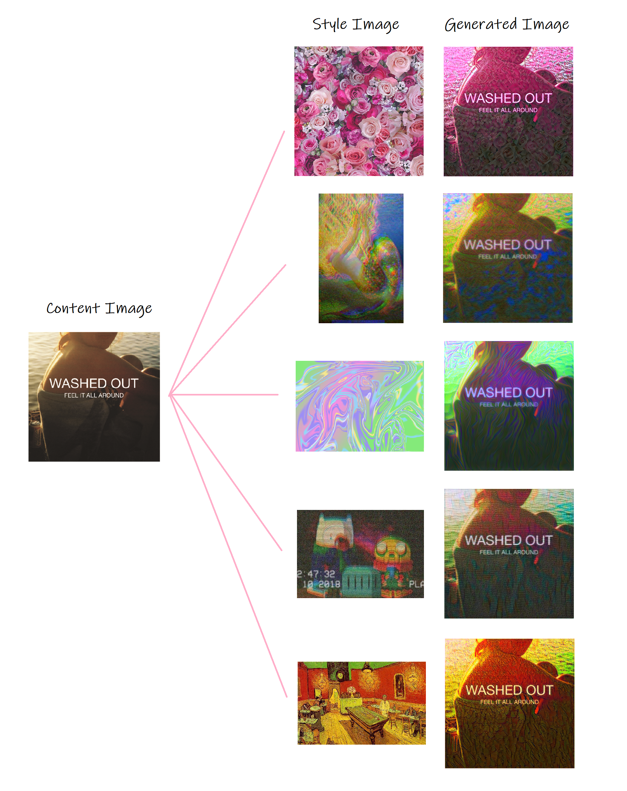

# Neural Style Transfer in PyTorch

This is my own implementation of Neural Style Transfer using PyTorch, introduced in [this paper](https://www.cv-foundation.org/openaccess/content_cvpr_2016/papers/Gatys_Image_Style_Transfer_CVPR_2016_paper.pdf).
The main task was to generate an image that takes colours & stroke style of one image and copies the high-level contents (shapes) of the 2nd image.
Instead of building a deep convolutional neural network from scratch, I used **VGG19** for transfer learning. 

## Repository 

This repository contains:
* **style_transfer.py** : Complete code for ALL steps of CycleGAN Implementation
* **style_transfer.ipynb** : Jupyter notebook explaining step-by-step procedures for implementing CycleGAN 
                      (based off [this source](https://github.com/udacity/deep-learning-v2-pytorch/tree/master/style_transfer), but with modified parameters for better performace of the model.)
					  
## Results

(some examples of the result)

## Inputs

There are only 2 image inputs in this program: **Content Image** & **Style Image**

## List of Hyperparameters used:

* alpha (content image weight) = **1**
* beta (style image weight) = **1e4**  
* weights of 5 style layers of vgg19 = **{'conv1_1': 1., 'conv2_1': 0.4, 'conv3_1': 0.2, 'conv4_1': 0.1, 'conv5_1': 0.05}**
* maximum length of the smaller edge of image tensor (to resize large input images)  = **400**
* Learning Rate = **0.003**
* Number of Epochs = **2000**

